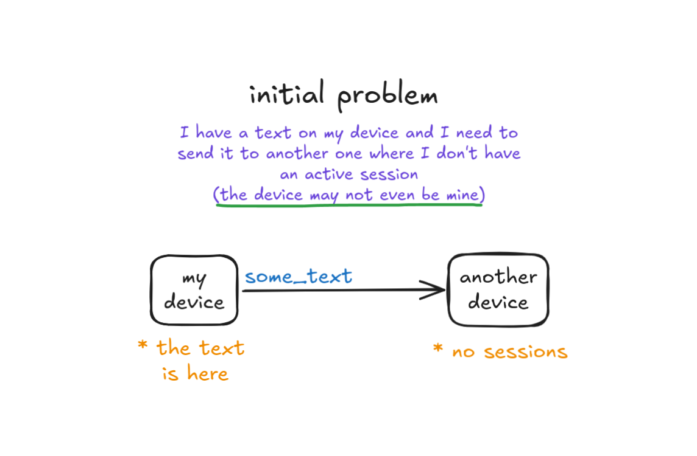
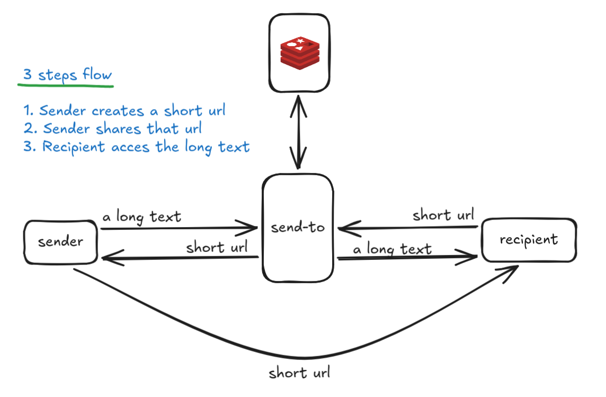

# Send To

A high-performance, ephemeral text-sharing service designed to bridge the gap between devices without requiring shared sessions or authentication

## The Problem

During my college years, I frequently faced a frustrating hurdle: I needed to quickly send snippets of text from my smartphone to a shared classroom computer where I had no active session. Traditional workarounds like emailing myself or opening third-party messaging apps were far too slow and left unnecessary digital footprints

## The Solution

This tool simplifies text transfer into a seamless, three-step flow:

1. Create: Input your text to instantly generate a compact, alphanumeric short URL
2. Share: Send the short URL to the target device
3. Access: The recipient opens the URL to view the original text immediately

## Engineering

### Functional Requirements

1. Content creation: given user-supplied text => generate a short URL
2. Content receiving: given a short URL => provide access to the original text

### Non-Functional Requirements

- The short URL should be as short as possible
- Only numbers (0-9) and letters (a-z and A-Z) are allowed in the URL
- The system must support 10 million pieces of content generated per day
- For each write operation, there will be 10 read operations
- Content must be stored for a maximum period of 30 minutes
- Content must be stored in plain text
- The average size of stored content is 1000 characters

#### Estimates

- Writes: 10 million de contents/day ≈ 115 WPS
- Reads: 100 million de reads/day ≈ 1.150 RPS
- Data volume: 10 million texts x 1.000 characters (1 KB) = 10 GB/day
- Since the data disappears in 30 minutes, the peak memory usage in database at that time will be approximately 208 MB

## Stack

- Next.js
- Elysia
- Redis

## Next Features

- [ ] Password protected shares
- [ ] Data encryption

## License

MIT by [Wolney Oliveira](https://wolney.dev/)
